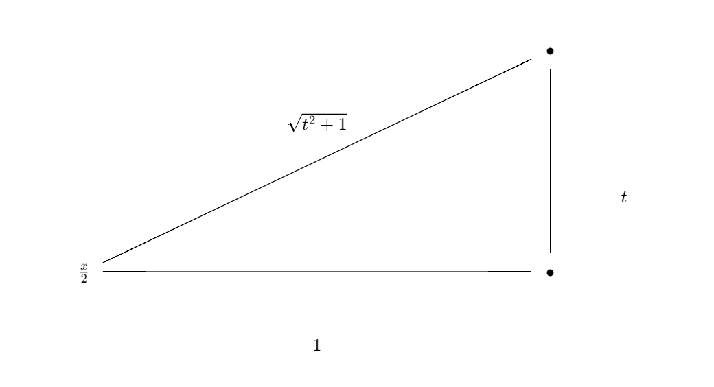

Suppose we wish to integrate a rational function in form:
$$
\int f(\sin(x),\cos(x)) dx
$$

Using the Weierstrass substiution, of $t = \tan(x/2)$, we can convert a rational composition of sines and cosines to a rational composition of $t$.

# Derivation
Suppose we construct a right-angled triangle, following $t= \tan(x/2)$:

We gather that $\sin(x/2) = \frac{t}{\sqrt{t^2+1}}$, and $\cos(x/2) = \frac{1}{\sqrt{t^2+1}}$. Thus, via angle identities, it follows that:
$$
\begin{align*}
\sin(x) &= 2\sin(x/2)\cos(x/2) = \frac{2t}{1+t^2} \newline
\cos(x) &= 2\cos^2(x/2)-1 = \frac{1-t^2}{1+t^2}
\end{align*}
$$
Finally, to fully utilize the subsitution, we must find the relation ship between $dt$ and $dx$:

$$
\begin{align*}
t &= \tan(x/2) \newline
2\arctan(t) &=x\newline
\frac{2}{1+t^2} dt &= dx
\end{align*}
$$

# Example
$$\int \frac{1}{3\sin x - 4 \cos x}$$

By making the substitution $t= \tan(x/2)$, and our definitions from above:

$$= \int \frac{1}{\frac{6t}{1+t^2} - \frac{4(1-t^2)}{1+t^2}} \frac{2}{1+t^2}dt$$

Note that we may conveniently cancel out a $1+t^2$, giving us the integral:
$$\begin{align*}
&= \int \frac{2}{6t-4+4t^2} dt \newline
&= \int \frac{1}{2t^2-3t+4} dt
\end{align*}
$$
Doing partial fraction decomposition:
$$ = \int \frac{2}{5(2t-1)} - \frac{1}{5(t+2)}dt $$
Which are standard integrals in form $1/x$:

$$\begin{align*}
&= \frac{1}{5} \ln |2t-1| - \frac{1}{5}\ln|t+2| \newline
&= \frac{1}{5} \ln|2\tan(x/2) -1 | - \frac{1}{5}\ln |\tan(x/2) + 2|
\end{align*}$$
